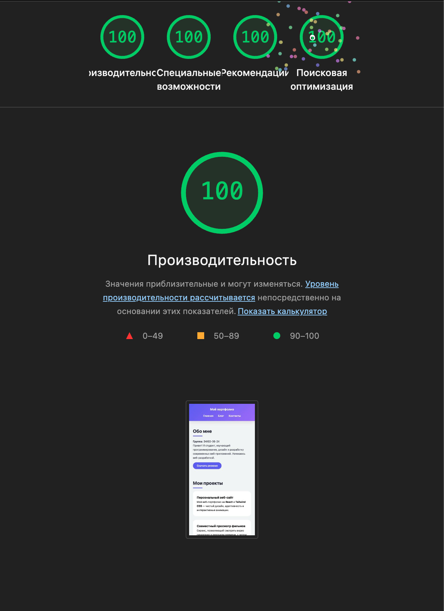
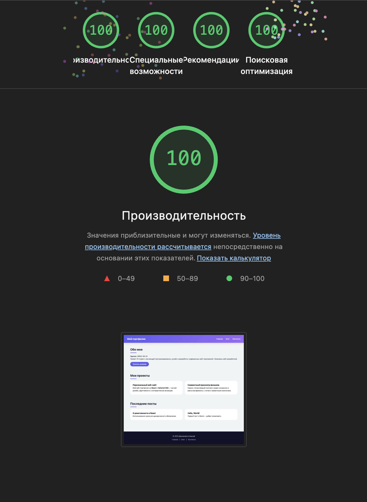

# Персональное портфолио

Учебный сайт-портфолио, созданный для сдачи контрольной работы №3 по дисциплине
"Фронтенд и бэкенд разработка" в РТУ МИРЭА.

Основная задача - реализация адаптивной вёрстки, проходящей валидацию по W3C и
имеющая хорошие показатели в Lighthouse.

### Результаты Lighthouse

<table>
<tr>
<td align="center" width="50%">

#### Мобильная версия

</td>
<td align="center" width="50%">

#### Десктопная версия

</td>
</tr>
</table>
